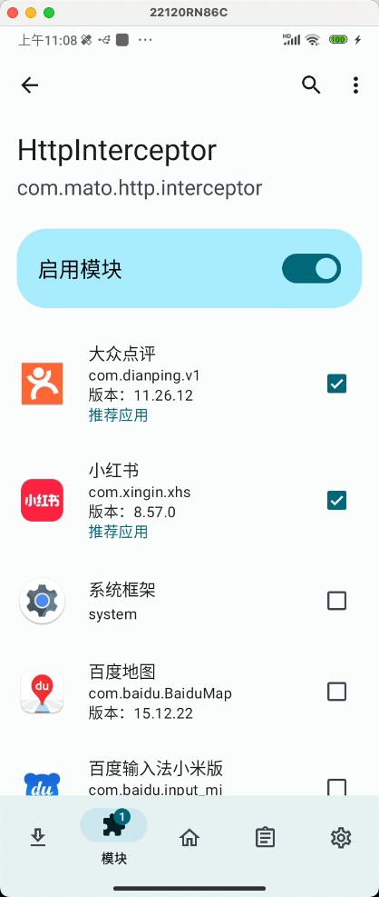
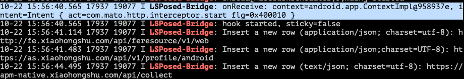
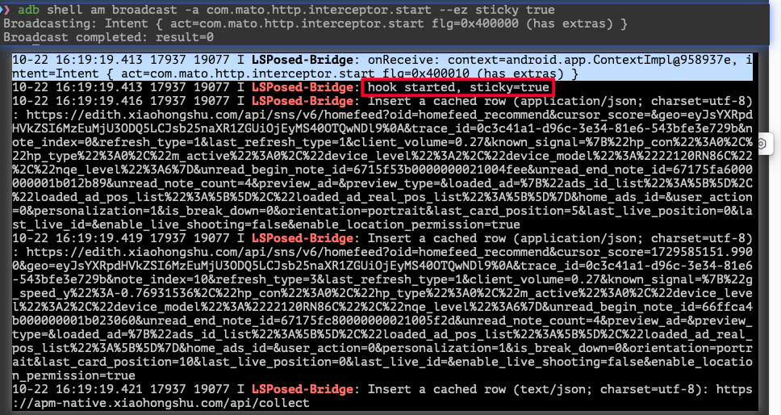
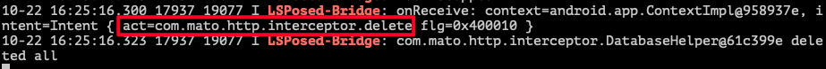
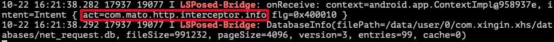
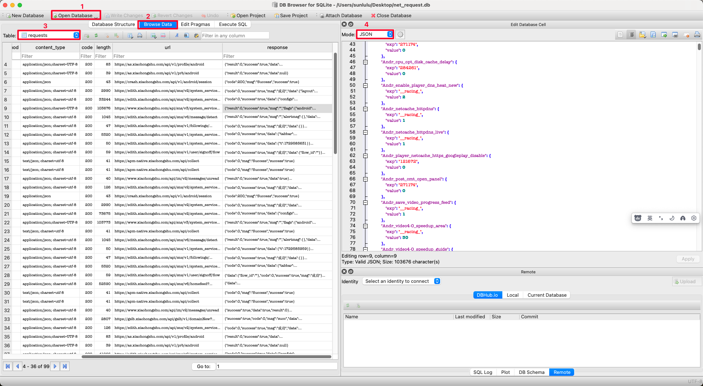
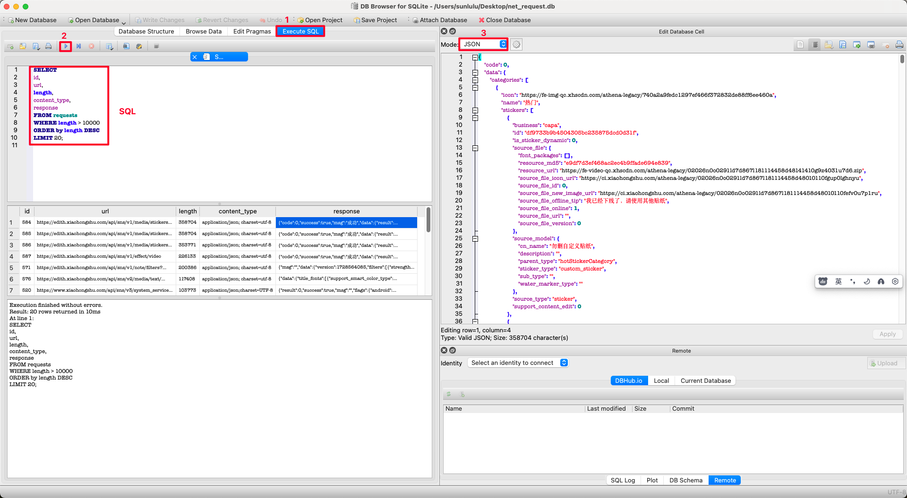
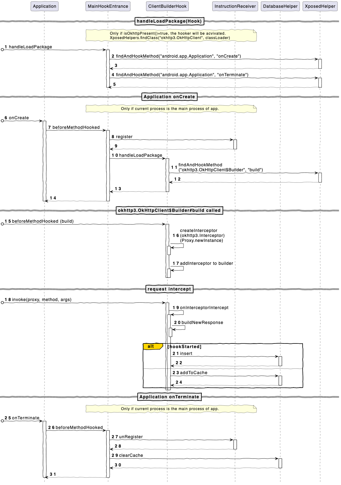

[](https://kotlinlang.org) [](https://opensource.org/license/mit) 

# Http Interceptor

This project is a http/https requests hook tool for apps with okhttp3.

## Features
- [x] Enable http/https requests hook for all the apps used okhttp3.
- [x] Support text/json/xml style requests, and save them to Android built-in SQLite.
- [x] Used BroadcastReceiver to receive instructions for controlling flow, such as start, stop, info, delete...
- [x] Support sticky events: before your send start instruction, the requests will be cached, and when you start with parameter "--ez sticky true", the cached requests will be saved to the database.

## Setup

<div style="display: flex;">
  <div style="flex: 2; padding: 10px;">
    <ol>
      <li>Get a rooted Android mobile phone.</li>
      <li>Installed <a href="https://magiskcn.com/">Magisk</a> and <a href="https://magiskcn.com/lsposed-install">LSPosed Framework.</a></li>
      <li>Download the latest release apk and install it.</li>
      <li>Activate the apk as a plugin in LSPosed.</li>
      <li>Select apps you want to hook.</li>
      <li>Send instructions via abd shell to control flow.</li>
    </ol>
  </div>
  <div style="flex: 1; padding: 10px;">
    
  </div>
</div>

## How to use

### Instructions
This tool uses adb shell to send instructions to control the flow. For example, you can get started 
via `adb shell am broadcast -a com.mato.http.interceptor.start`.

Supported instructions: 
<table>
  <tr>
    <th>name</th>
    <th>action</th>
    <th>parameters</th>
    <th>sample</th>
  </tr>
  <tr>
    <td>start</td>
    <td>com.mato.http.interceptor.start</td>
    <td>sticky: bool</td>
    <td>
      </img>
      </img>
    </td>
  </tr>
  <tr>
    <td>stop</td>
    <td>com.mato.http.interceptor.stop</td>
    <td align="center">-</td>
    <td></img></td>
  </tr>
  <tr>
    <td>delete</td>
    <td>com.mato.http.interceptor.delete</td>
    <td align="center">-</td>
    <td></img></td>
  </tr>
  <tr>
    <td>info</td>
    <td>com.mato.http.interceptor.info</td>
    <td align="center">-</td>
    <td></img></td>
  </tr>
</table>

### Preview
1. Use the `info` instruction to show .db file location and basic info.
```sh
❯ adb shell am broadcast -a com.mato.http.interceptor.info
Broadcasting: Intent { act=com.mato.http.interceptor.info flg=0x400000 }
Broadcast completed: result=0
```
2. Then, you will get the output from console/logcat. (Filter: `LSPosed-Bridge`). In this case, the .db file path is `/data/user/0/com.xingin.xhs/databases/net_request.db`.
```text
10-22 16:32:47.988 17937 19077 I LSPosed-Bridge: onReceive: context=android.app.ContextImpl@958937e, intent=Intent { act=com.mato.http.interceptor.info flg=0x400010 }
10-22 16:32:47.990 17937 19077 I LSPosed-Bridge: DatabaseInfo(filePath=/data/user/0/com.xingin.xhs/databases/net_request.db, fileSize=20480, pageSize=4096, version=3, entries=0, cache=30)
```
3. Use adb to pull the file to PC. If the .db file cannot be pulled directly, copy it to other directory first.
```sh
❯ adb shell
earth:/ $ su root
earth:/ # cp /data/user/0/com.xingin.xhs/databases/net_request.db /sdcard/
earth:/ # ^D
earth:/ $ ^D
❯ adb pull /sdcard/net_request.db ~/Desktop
/sdcard/net_request.db: 1 file pulled, 0 skipped. 1.9 MB/s (20480 bytes in 0.010s)
```
4. Preview the .db file in [DB Broswer for SQLite](https://sqlitebrowser.org/). Click **[Open Database]**, **[Browse Data]** and select table **requests**.

5. Execute SQL on your demand.

## How it works


## Contributors

Thank you all for your work! ❤️

<a href="https://github.com/sunlulu427/HttpInterceptor/graphs/contributors">
  
</a>